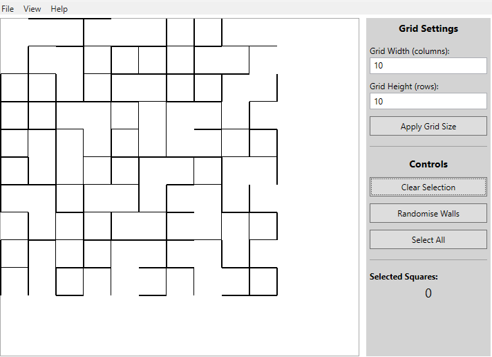

# Grid Exemplar WPF - Transitioning from Console to GUI

## 📋 Overview

This project shows how to start a WPF application that might be used to present mazes. It will draw a grid of squares on the screen, using a square data structure that stores which walls should be drawn. 
Many A-level students prototype their NEA projects in the command line first (which is good practice!), but then struggle to translate that working code into a graphical WPF application. This project demonstrates:

1. How the **same data structure** (`Square[,]` grid) works in both console and WPF
2. How **console rendering logic** translates to **WPF rendering logic**
3. How to **structure a WPF project** to keep code maintainable
4. How to **preserve your prototype's core algorithms** when moving to GUI



> **Note on Authorship**: This project, including code, documentation, and this README, was generated by AI as an educational resource for A-Level Computer Science teachers and students. It is intended to demonstrate concepts and techniques, **not** to serve as a template for student NEA projects.

---

## 🎯 What This Project Teaches

**This exemplar is specifically designed to help AQA 7517 NEA students who are:**
- Moving from a **command-line prototype** to a **WPF graphical application**
- Learning how to **structure a GUI project** with proper separation of concerns
- Understanding how **the same data structures** work in both console and WPF contexts
- Looking to implement **grid-based projects** (mazes, game boards, cellular automata, etc.)

**Skills Covered:**
✅ Transitioning console logic to WPF  
✅ Separating data models from rendering code  
✅ Using 2D arrays to represent grids  
✅ Creating custom classes to encapsulate cell data  
✅ Handling mouse events in WPF  
✅ Proper project structure and separation of concerns  

**What This Is NOT:**
❌ A complete A-level NEA project  
❌ A template to copy (your NEA must be original work)  
❌ An example of complex algorithms (maze generation, pathfinding, etc.)  
❌ Advanced features (file I/O, databases, complex UI)  

> **Important:** This exemplar teaches foundational concepts only. Your NEA must include sophisticated algorithms, data structures, and problem-solving that go far beyond what's shown here. Use this to learn how to structure your WPF project, then implement your own unique solution.

---

## 🏗️ Project Structure

### Core Files

| File | Purpose | Learning Focus |
|------|---------|----------------|
| **`Square.cs`** | Data model for a single grid cell | Creating custom classes, encapsulating state |
| **`GridRendererConsole.cs`** | Console-based grid renderer | Your prototype's rendering approach |
| **`GridRenderer.cs`** | WPF-based grid renderer | Translating console logic to WPF |
| **`MainWindow.xaml`** | UI layout definition | WPF UI design (buttons, canvas, etc.) |
| **`MainWindow.xaml.cs`** | UI event handling & app state | Event-driven programming, state management |

### Architecture: Separation of Concerns

This project deliberately separates code into distinct responsibilities - a crucial skill for larger NEA projects:

```
┌─────────────────────────────────────────────────────────────┐
│                    MainWindow.xaml.cs                       │
│  - Stores application state (grid, selections, settings)   │
│  - Handles user events (clicks, button presses)            │
│  - Triggers redraws when state changes                     │
└─────────────────────┬───────────────────────────────────────┘
                      │ calls Redraw()
                      ↓
┌─────────────────────────────────────────────────────────────┐
│                    GridRenderer.cs                          │
│  - Takes Square[,] grid as input                           │
│  - Converts grid data into WPF shapes (Rectangle, Line)    │
│  - Adds shapes to Canvas                                   │
└─────────────────────────────────────────────────────────────┘
                      │ reads from
                      ↓
┌─────────────────────────────────────────────────────────────┐
│                    Square[,] grid                           │
│  - Pure data: positions, walls, selection state            │
│  - No rendering logic, no UI dependencies                  │
└─────────────────────────────────────────────────────────────┘
```

**Why does this matter for your NEA?**

Many students end up with a single 1000+ line `MainWindow.xaml.cs` file that mixes:
- Data structures (grid, graph, game state)
- Algorithms (pathfinding, generation, AI logic)
- Rendering code (drawing everything on canvas)
- Event handling (mouse clicks, button presses)

This becomes **impossible to debug, test, or extend**. By separating concerns:
- ✅ You can test algorithms independently of the UI
- ✅ You can swap rendering approaches without breaking logic
- ✅ Your code is easier for examiners to understand
- ✅ You can demonstrate proper software engineering practices

---

## 🔄 From Console to WPF: A Side-by-Side Comparison

### The Data Model (Unchanged!)

**The good news:** Your data structures from your console prototype work identically in WPF!

```csharp
// This Square class works in BOTH console and WPF applications
public class Square
{
    public int X { get; set; }          // Pixel coordinates (for WPF)
    public int Y { get; set; }          // But also works for grid position
    public int Size { get; set; }       // Cell size
    
    public bool NorthWall { get; set; } // Wall states
    public bool EastWall { get; set; }
    public bool SouthWall { get; set; }
    public bool WestWall { get; set; }
    
    public bool IsSelected { get; set; } // Selection state
}

// Creating the grid - IDENTICAL in console and WPF
Square[,] grid = new Square[rows, cols];
for (int row = 0; row < rows; row++)
{
    for (int col = 0; col < cols; col++)
    {
        grid[row, col] = new Square(x, y, size);
        grid[row, col].RandomiseWalls(random);
    }
}
```

### Rendering: Console vs WPF

**Console Version** (`GridRendererConsole.cs`):
```csharp
public void DrawGrid(Square[,] grid, bool showGridLines)
{
    Console.Clear();
    for (int row = 0; row < rows; row++)
    {
        for (int col = 0; col < cols; col++)
        {
            Square square = grid[row, col];
            
            // Draw using characters
            Console.Write(square.NorthWall ? "───" : "   ");
            Console.Write(square.IsSelected ? " X " : "   ");
        }
        Console.WriteLine();
    }
}
```

**WPF Version** (`GridRenderer.cs`):
```csharp
public void DrawGrid(Square[,] grid, bool showGridLines)
{
    canvas.Children.Clear();
    for (int row = 0; row < rows; row++)
    {
        for (int col = 0; col < cols; col++)
        {
            Square square = grid[row, col];
            
            // Draw using WPF shapes
            Line northLine = new Line 
            { 
                X1 = square.X, Y1 = square.Y,
                X2 = square.X + square.Size, Y2 = square.Y,
                Stroke = Brushes.Black
            };
            canvas.Children.Add(northLine);
        }
    }
}
```

**Key Insight:** The logic is almost identical! Both:
1. Loop through rows and columns
2. Access the same `Square` objects
3. Check wall states (`NorthWall`, etc.)
4. Decide what to draw based on state

Only the **output method** changes:
- Console: `Console.Write()` with characters
- WPF: `canvas.Children.Add()` with shapes

---

## 🎓 How to Use This as a Learning Tool

### Step 1: Understand the Console Version First

1. Open [`GridRendererConsole.cs`](GridRendererConsole.cs) and read through it
2. Notice how it uses box-drawing characters (`│ ─ ┌ ┐`) to represent walls
3. See how it iterates through the `Square[,]` grid
4. Find the `ExampleUsage()` method to see a complete console example

**This is similar to your command-line prototype!**

### Step 2: Compare to the WPF Version

1. Open [`GridRenderer.cs`](GridRenderer.cs) side-by-side with `GridRendererConsole.cs`
2. Notice the structural similarities:
   - Both take `Square[,] grid` as a parameter
   - Both have a `DrawGrid()` method
   - Both iterate through rows/columns identically
   - Both check wall states the same way
3. Identify the key differences:
   - Console uses `Console.Write()`, WPF uses `canvas.Children.Add()`
   - Console uses characters, WPF uses `Line` and `Rectangle` objects

### Step 3: Understand the Main Window

1. Open [`MainWindow.xaml.cs`](MainWindow.xaml.cs)
2. Notice how it:
   - Creates and stores the `Square[,] grid` (just like your console app would)
   - Has a `Redraw()` method that calls `renderer.DrawGrid()`
   - Handles events (button clicks, mouse clicks) and then calls `Redraw()`

**Pattern:** Change state → Call `Redraw()` → Renderer updates display

### Step 4: Trace Through a User Action

Follow what happens when a user clicks on a cell:

```
1. User clicks canvas
   ↓ 
2. Canvas_MouseLeftButtonDown() event fires
   ↓
3. Code finds which Square was clicked
   ↓
4. Changes square.IsSelected = true  (data change)
   ↓
5. Calls Redraw()
   ↓
6. Redraw() calls renderer.DrawGrid(grid)
   ↓
7. GridRenderer reads grid data and creates WPF shapes
   ↓
8. User sees updated display
```

---

## 🚀 Adapting This for Your NEA

### What to Keep

- ✅ The **separation of concerns** architecture
- ✅ The **renderer pattern** (separate rendering from logic)
- ✅ The **2D array** approach for grid storage (if suitable)
- ✅ The **custom class** approach (`Square` as a template)

### What to Change/Add

Your NEA needs **much more** than this example provides:

#### 1. **Sophisticated Algorithms**
This example only has random wall generation. You need:
- Maze generation algorithms (recursive backtracking, Prim's, Kruskal's)
- Pathfinding algorithms (A*, Dijkstra, breadth-first search)
- Game logic (rules enforcement, AI opponents)
- Simulation logic (cellular automata, Conway's Life)

#### 2. **Complex Data Structures**
This example uses a simple 2D array. Consider:
- **Adjacency lists** for graphs
- **Priority queues** for pathfinding
- **Stacks/queues** for algorithm implementation
- **Trees** for hierarchical data

#### 3. **Advanced Features**
This example is minimal. Your NEA should include:
- **File I/O** (save/load mazes, configurations, high scores)
- **Animation** (showing algorithm progress step-by-step)
- **Configuration options** (algorithm parameters, visual themes)
- **Statistics/analysis** (path length, nodes visited, performance metrics)
- **Error handling** (validation, edge cases, user input)

#### 4. **Evidence of Planning**
Your NEA requires:
- **Analysis** (stakeholder interviews, research, problem identification)
- **Design** (pseudocode, flowcharts, class diagrams)
- **Testing** (comprehensive test plans with expected/actual results)
- **Evaluation** (success criteria, user feedback, improvements)

---

## 💡 Common Student Questions

### "Can I use this code in my NEA?"

**No.** Your NEA must be your own original work. Use this to:
- ✅ Learn how to structure a WPF project
- ✅ Understand the console-to-WPF transition
- ✅ See an example of separation of concerns

Then **write your own code** that solves **your own identified problem**.

### "My console prototype has [algorithm X]. How do I move it to WPF?"

The key insight: **You don't need to rewrite your algorithm!**

If you have working maze generation/pathfinding/game logic in console:
1. **Keep that logic in a separate class** (e.g., `MazeGenerator`, `PathFinder`)
2. **Keep your grid/graph data structure** (it works the same in WPF)
3. **Only change the rendering** (create a `Renderer` class like this example)
4. **Call your algorithms from button click events** instead of console menu loops

Example:
```csharp
// Your console prototype (keep this logic!)
public class MazeGenerator
{
    public void GenerateMaze(Cell[,] grid) 
    { 
        // Your algorithm here - UNCHANGED
    }
}

// Your WPF MainWindow
private void GenerateMazeButton_Click(object sender, RoutedEventArgs e)
{
    mazeGenerator.GenerateMaze(grid);  // Same algorithm call
    Redraw();                           // Just add this to update display
}
```

### "Why bother with console first?"

Benefits of prototyping in console:
- ✅ Faster to test algorithms without GUI overhead
- ✅ Easier to debug (print statements, step-through)
- ✅ Proves your logic works before adding UI complexity
- ✅ Shows good development practice (prototype → refine → implement)

### "How much code should be in MainWindow.xaml.cs?"

**Minimal!** It should mostly:
- Store application state
- Handle events (button clicks, mouse clicks)
- Call methods in other classes (renderer, algorithms)
- Trigger redraws

**Not in MainWindow:**
- ❌ Algorithm implementation (put in separate classes)
- ❌ Complex rendering logic (put in renderer class)
- ❌ File I/O operations (put in a data manager class)

Aim for: **Event happens → Change data → Call Redraw()** pattern.

---

## 📚 Key Takeaways for NEA Success

1. **Prototype in console, then port to WPF** - proves your logic works first
2. **Separate concerns** - data, algorithms, rendering, and UI should be in different classes
3. **Your data structures don't change** - `Square[,]` works the same in console and WPF
4. **Only rendering changes** - from `Console.Write()` to `canvas.Children.Add()`
5. **This is a learning tool, not a template** - write your own project from scratch

---

## 🏃 Running the Project

1. Open `GridExemplarWPF.sln` in Visual Studio
2. Press **F5** to build and run
3. Experiment with:
   - Clicking cells to select/deselect
   - Randomizing walls
   - Changing grid size
   - Toggling grid line visibility

---

## 📖 Further Reading

- [WPF Graphics Rendering Overview](https://docs.microsoft.com/en-us/dotnet/desktop/wpf/graphics-multimedia/wpf-graphics-rendering-overview)
- [2D Arrays in C#](https://docs.microsoft.com/en-us/dotnet/csharp/programming-guide/arrays/multidimensional-arrays)
- [Separation of Concerns](https://en.wikipedia.org/wiki/Separation_of_concerns)
- AQA 7517 NEA Specification (refer to your teacher/exam board)
